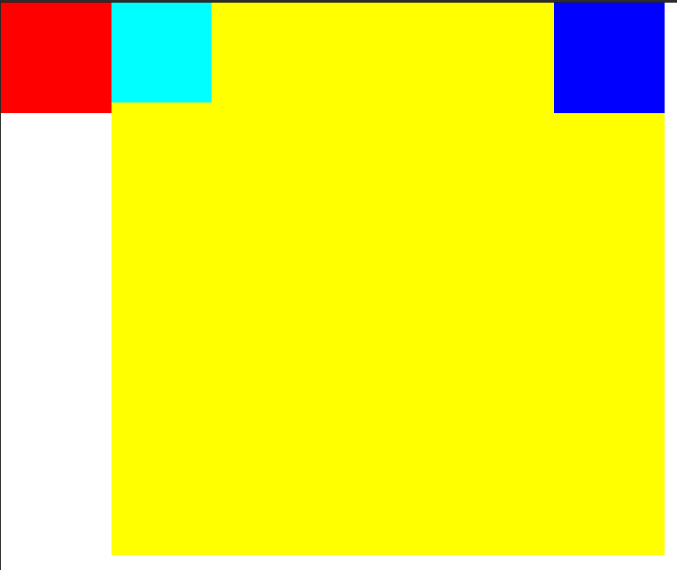

# 前端
## 引言
前端由三种语言构成，分别定义的前端的不同部分：
+ HTML -> 结构
+ CSS -> 表现(样式)
+ JavaScript -> 行为
## HTML 超文本标记语言
负责页面的结构，使用标签的形式标识网页的组成部分
### HTML 基本结构
``` html
<html>
    <head>
        <!-- 头标签显示为页面的名字 -->
        <meta charset="UTF-8" />
        <title> 这是一个头标签</title>
    </head>
    <body>
        <!--注释-->
        <h1>一级标题</h1>
        <!-- p 独占一段 -->
        <p>你好，世界</p>
        <h2>二级标题</h2>
        <!-- 标题从<h1>~<h6> -->
        <p>这是我的第一个HTML文档</p>
        <ol>
            <!-- 在ol中输入li表示序列且有序号，在ol外没有序号 -->
            <li>第一点</li>
            <li>第二点</li>
        </ol>
    </body>
</html>
```
标签分为块标签和行标签。块标签中可以包含行标签，但是不能包含块标签。

描述和关键词
```html
<meta name="description" content="描述">
<meta name="keyword" content="关键词">
```
列表
```html
<ul>
    <li>无序列标签</li>
</ul>
<ol>
    <li>有序列标签</li>
</ol>
<dl>
    <!-- 定义列表 -->
    <dt>定义词</dt>
    <dd>定义一</dd>
    <dd>定义二</dd>
</dl>
```
### 转义字符
|转义字符|含义|
|:----:|:--:|
|`<br>`|换行|
|`&nbsp;`|空格|
|`<em>`|斜体|
|`<strong>`|加粗|
|`<blockquote>`|块引用|
|`<div>`|语义标签-块|
|`<span>`|语义标签-行|
### 重要的标签
#### 超链接 
+ href属性
```html
<a href="https://www.baidu.com">通过网址定义超链接；</a>
<a href="./vim.md">通过相对路径超链接</a>
<a href="#">跳转到网页的最开始</a>
<a href="#ID">跳转到指定的位置</a>
<a href="javascript:;">占位，不跳转，为了之后填充</a>
```
+ target
```html
<a href="https://www.baidu.com" target="_black">在新的页面打开</a>
```
#### img标签
+ src属性和alt属性
```html

```
#### 其他标签
```html
<!-- 嵌入页面 -->
<iframe src="https://www.baidu.com" frameborder="0" width="1920px" height="1080px"></iframe>
```
#### input标签
```html
<input type="text"><br>
<input type="password"><br>
<!-- value 给一个默认值 disabled 不能修改 -->
<input type="text" value="默认" disabled><br>
<input type="text" value="默认"><br>
<input type="button" value="按钮">
<!-- 复选框 -->
<!-- checked 默认选中 -->
<div>
	<input type="checkbox" name="ah" checked>羽毛球<br>
	<input type="checkbox" name="ah">足球<br>
	<input type="checkbox" name="ah">其他<br>
</div>
<!-- 单选框 -->
<div>
	<input type="radio" name="sex" checked>男<br>
	<input type="radio" name="sex" >女<br>
	<input type="radio" name="sex">其他<br>
</div>
<!-- 选择文件 -->
<input type="file">
```
### 表格
```html
<!-- css样式：表格文本居中 -->
<style>
	td {
		text-align: center;
	}
</style>

<!-- border 表格线宽；cellpdding 表格内容与单元格线之间的间隔 cellspacing 单元格之间的间隔 -->
<table border="3px" cellpadding="5px" cellspacing="15px" width="600px">
	<tr>
		<th>周一</th>
		<th>周二</th>
		<th>周三</th>
		<th>周四</th>
		<th>周五</th>
	</tr>
	<tr>
		<td rowspan="2">数学1</td>
		<td>语文1</td>
		<td>英语1</td>
		<td>物理1</td>
		<td>化学1</td>
	</tr>
	<tr>
		<td>数学2</td>
		<td>语文2</td>
		<td>英语2</td>
		<td>物理2</td>
		<td>化学2</td>
	</tr>
	<tr>
		<td colspan="2">数学3</td>
		<td>语文3</td>
		<td>英语3</td>
		<td>物理3</td>
		<td>化学3</td>
	</tr>
</table>
```
### 接口请求
```html
<!-- post请求 -->
<form action="https://www-pre.banyuan.club/api/user/login" method="POST">
	<!-- 输入框 -->
	<div>
		<input type="text" name="phone" placeholder="请输入手机号码">
	</div>
	<!-- 密码输入框 -->
	<div>
		<input type="password" name="password" placeholder="请输入密码">
	</div>
	<!-- 提交按钮 -->
	<div>
		<button type="submit">登录</button>
		<button type="reset">清空</button>
	</div>
</form>
<!-- get请求 -->
<form action="https://www-pre.banyuan.club/api/liveCourse/displayList?" method="GET">
	<!-- 提交按钮 -->
	<div>
		<button type="submit">请求</button>
	</div>
</form>
```

## css
### 基础
#### css的特性
+ 继承 子元素可以继承父元素的属性属性（文本字号和颜色等）
+ 层叠 对于多次修改的属性，以最近一次的修改为准
+ 优先级 !important>行内元素>id选择器>class选择器>tag选择器>通配符*>继承>浏览器默认样式，其中!important不会这个强制属性不会被继承
```html
<style>
div{
    color: yellow;
}
.box{
    font-size: 20px;
    color: #ff2244 !important;
    width: 200px;
    height: 200px;
}
#div1{
    color: black;
}
span{
    color: royalblue;
}
</style>
<div class="box" id = "div1">
    <p>12345657 <span>span</span></p>
</div>
<!-- span 将展示royalblue颜色，对div的class的属性定义，对span来说是继承，!important属性没有继承下来 -->
```

#### css格式
+ 内联样式（行内样式）在标签开头内写
```html
<h1 style="font-size: 60px;background-color:rgb(100,100,0);">文章的标题</h1>
```
+ 内部样式表,在`<head>`中定义`<style>`;书写一类标签的样式,但是行内样式优先
```html
    <style>
        h2{
            font-size: 50px;
            color: dodgerblue;
        }
    </style>
```
+ 外部样式表在css文件中书写样式
```html
    <!-- 连接css文件 -->
    <link rel="stylesheet" href="./css-1.css">
```
```css
/*注释的写法*/
h2{
    color: crimson;
    background-color: aqua;
    font-size: 50px;
}
/*  h2 是选择器
    color是属性
    :后面是属性值
    不同的属性对之间用;分隔
*/
```
### 选择器
+ 元素选择器，直接通过标签名称选择
+ 类选择器,class定义一类标签
```html
<head>
<style>
    .red{
        color: red;
    }
    .font{
        font-size: 60px;
    }
</style>
</head>
<body>
    <p class="red font">第一段</p>
</body>
```
+ id选择器，id定义一个标签
```css
#p3{
    font-size: 60px;
}
```
```html
    <p id="p3">第3段</p>
```
+ *通配符选择器，修改其他选择器剩下的标签
+ 分组选择器
```css
/*选择h1和h2*/
h1,h2{
    color:red;
}
/*把多个选择器放在一起没有分隔表示同时满足条件*/
.bar.foo/*同时属于bar这个class也属于foo这个class*/
{
    font-size:60px;
}
/*父子选择器*/
div>p{}
/*后代选择器*/
div span{}
/*邻接兄弟*/
q+span{}/*选择q后面的一个span，且span必须与q紧挨*/
/*直接兄弟*/
q~span{}/*选择q后面的全部span*/
/* 选择foo属性的 */
[foo]
[foo$="jack"]{}/*foo属性以jack结尾*/
[foo^="jack"]{}/*foo属性以jack开头*/
[foo*="jack"]{}/*foo属性中包含jack*/

/* 伪类标签 */
:first-child{}/*第一个元素*/
:last-child{}/*最后一个元素*/
:nth-child(2n+1){}/*第1个，第3个……元素*/

:first-of-type{}/*某个类型的第一个元素*/
:last-of-type{}/*某个类型的最后一个元素*/
:nth-of-type(2n+1){}/*某个类型的第1个，第3个……元素*/

a:link{}/*未访问的链接*/
a:visited{}/*访问过的链接*/
a:hover{}/*鼠标放上去的效果*/
a:active{}/*鼠标点击时的效果*/

p::first-letter{}/*第一个字*/
p::first-line{}/*第一行*/
p::before{content:"["}/*前面加[*/
p::after{content:"]"}/*后面加]*/

```
### 背景图片
```html
<style>
    .box{
    height: 300px;
    width: 1000px;
    border: solid 2px rgb(55, 0, 255);
    /* background-image: url(https://by-image.oss-cn-shanghai.aliyuncs.com/yfront/static/course/pic_xianxia2_banner.png); */
    background-image: url(http://by-image.oss-cn-shanghai.aliyuncs.com/Pre/drumkit/cover.jpg);
    background-repeat: no-repeat;
    /* background-size:contain; */
    background-position: 10px 100px;
    background-attachment: fixed;
}
</style>
<div class="box" ></div>
```
#### 字体
```html
<style>
#div1{
    font-family: STFangsong;
    font-size: 20px;
    font-weight:bolder;
    font-style: italic;
}
</style>
<div class="box" id = "div1">
    <p>12345657 <span>span 中文字体</span></p>
</div>
```
#### 文本属性
```css
    font-size: 20px;
    /* 首行缩进 */
    text-indent: 100px;
    text-indent: 2em;
    /* 文本对齐 */
    text-align: right;
    text-align: center;
    /* 字组间隔，根据空格分 */
    word-spacing: 50px;
    /* 字符间隔 */
    letter-spacing: 10px;
    /* 行高 */
    line-height: 50px;
    /* 字母装换 */
    text-transform: capitalize;
    text-transform: lowercase;
    text-transform: uppercase;
    /* 文本划线 */
    text-decoration: overline;
    text-decoration: underline;
    text-decoration: line-through;
```
### 盒子模型
+ 内边距 padding
+ 外边距 margin
+ 边框 border

盒子模型分为两种，标准模式和怪异模式`box-sizing: border-box;`。标准模式的padding不计算在width和heigth中，将导致盒子变大，怪异模式的padding计算在width和heigth中。
```html
<style>
    *{
        /* 怪异模式 */
        box-sizing: border-box;
    }
    .father{
        width: 500px;
        height: 500px;
        background-color: royalblue;
        /* 上右下左 */
        /* padding: 10px 20px 30px 40px; */
        /* 两个值的时候 上下一样 左右相同 */
        /* padding: 20px 50px ; */
        /* 三个值的时候 右边的值将与左边的值相同 */
        padding: 20px 40px 90px;
        /* margin 与padding相似 */
        border: double 10px red;
        /* border-top: dotted 2px yellow;
        border-left: dashed 5px blue;
        border-right: solid 3px brown;
        border-bottom: double 15px yellowgreen; */
    }
    .child{
        height: 100%;
        background-color: red;
    }
    .father2{
        width: 300px;
        height: 100px;
        background-color: blue;
    }
    .img-box{
        width: 100px;
        height: 100px;
        overflow: hidden;
    }
</style>
<body>
    <div class="father">
        <div class="child"></div>
    </div>
    <div class="father2"></div>
    <div class="img-box">
        
    </div>
</body>
```
#### marge重叠
当两个marge之间没有任何东西时，marge将重叠，重叠的大小取最大值；
+ 想让其不发生重叠，可以在marge中插入高度为0px的其他标签。
+ BFC独立渲染区，将父元素的overflow属性不设置为visible,此时父元素的内部的变化不会影响到外部。
#### float 悬浮
```html
<head>
    <meta charset="UTF-8">
    <meta name="viewport" content="width=device-width, initial-scale=1.0">
    <title>Document</title>
    <style>
        *{
            box-sizing: border-box;
            padding: 0px;
            margin: 0px;
        }
        .div1{
            width: 100px;
            height: 100px;
            background-color: red;
            float:left;
        }
        .div2{
            width: 500px;
            height: 500px;
            background-color: yellow;
            float: left;
        }
        .div3{
            width: 90px;
            height: 90px;
            background-color:aqua;
            float:left;
        }
        .div4{
            width: 100px;
            height: 100px;
            background-color: blue;
            float:right;
        }
    </style>
</head>
<body>
    <div class="div1"></div>
    <div class="div2">
        <div class="div3"></div>
        <div class="div4"></div>
    </div>
</body
```

+ float 不会撑大父标签的面积————高度塌陷
##### 高度塌陷解决方案
+ `clear:both;` 在需要撑起高度的元素后面添加一个`div`元素,在这个`div`的样式中添加`clear：both`
```html
<!DOCTYPE html>
<html lang="en">
<head>
    <meta charset="UTF-8">
    <meta name="viewport" content="width=device-width, initial-scale=1.0">
    <title>Document</title>
    <style>
        *{
            box-sizing: border-box;
            padding: 0px;
            margin: 0px;
        }
        .box{
        }
        .div1{
            width: 100px;
            height: 100px;
            background-color: brown;
            float: left;
        }
        .clear{
            clear: both;
        }
    </style>
</head>
<body>
    <div class="box">
        <div class="div1"></div>
        <div class="clear"></div>
    </div>
</body>
</html>
```
+ 伪元素 在需要撑起高度的元素的样式中添加 元素::after
```css
.box::after{
    content:"";
    display: block;
    clear: both;
}
```
#### 定位
+ 相对定位 使用`position: relative`使得元素能够进行定位
```css
.box{
    width: 100px;
    height: 100px;
    background-color: blue;
    position: relative;
    left: 30px;
    top: 30px;
}
```
+ 绝对定位 使用`position:absolute`使得元素进行定位 (从父级 一层层向上找，找到的 第一个开启了定位的 父元素或祖父元素...简称父++,相对于找到的这个父++元素定位)

#### 居中
```css
/* 文本水平居中 */
.p{
    text-align: center;
}
/* 块元素水平居中 方法一 */
.div{
    margin: auto;
}
/* 块元素水平居中 方法二 */
.child{
    /* 相对父元素右移50% */
    position:absolute;
    left: 50%;
    /* 向左偏移自身的一半元素 */
    margin-left: -25px;
}
/* 块元素水平居中 */
.child{
    position:absolute;
    top:50%;
    margin-top: -25px;
}
```